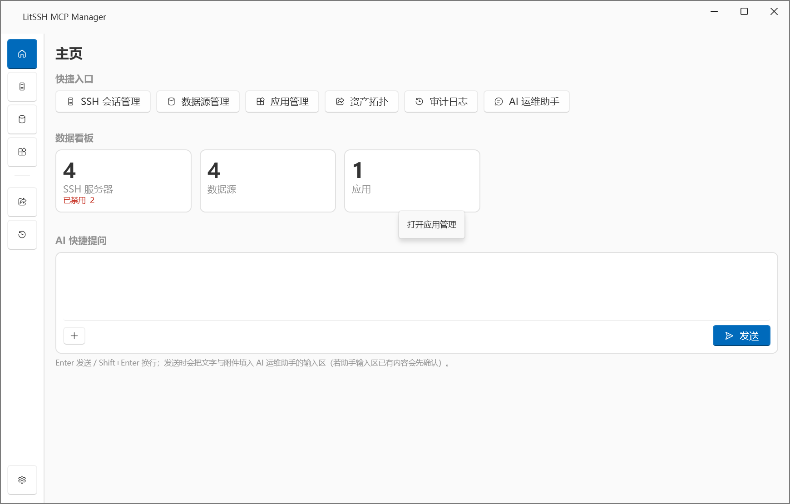
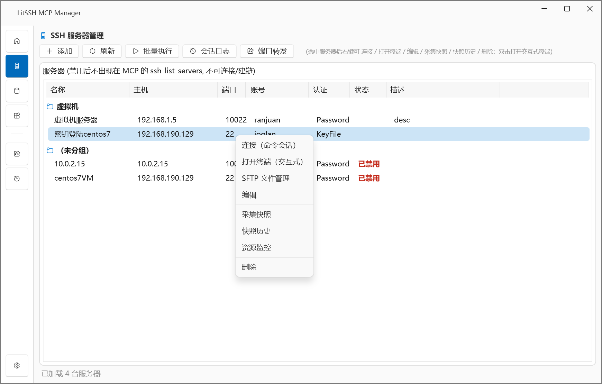
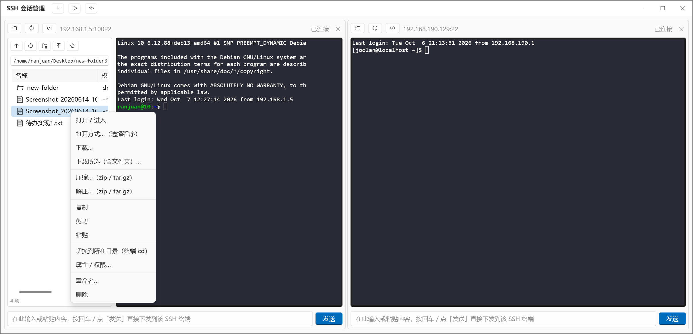
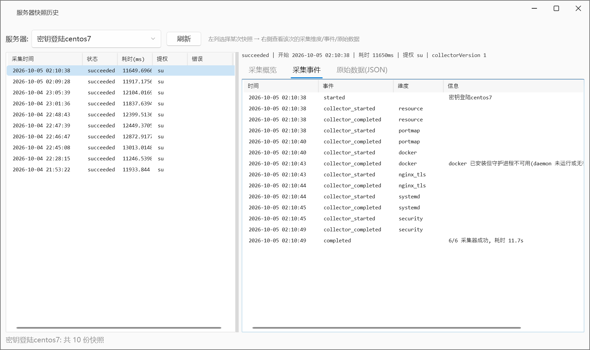
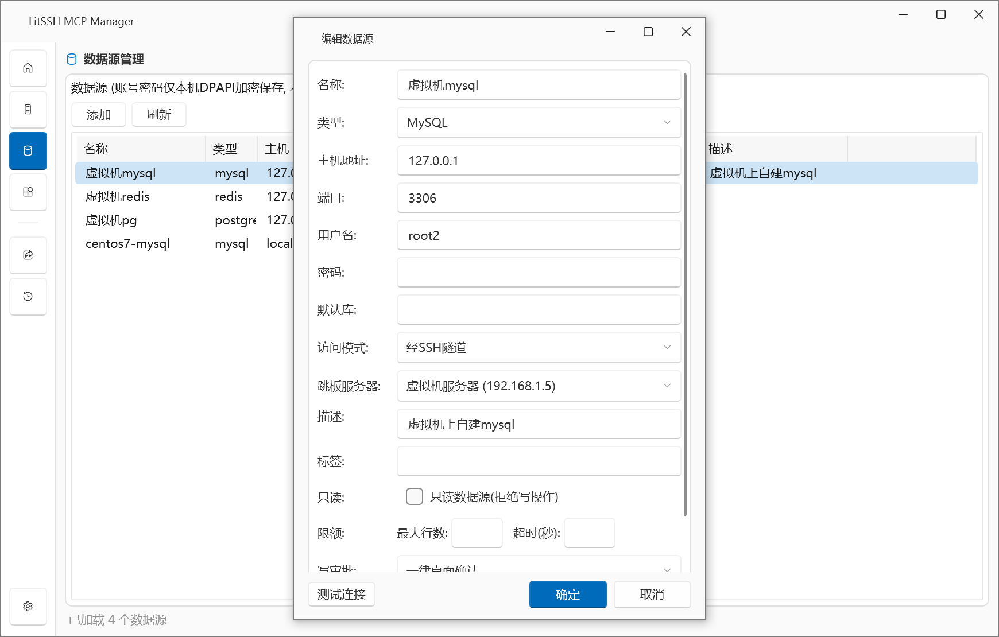
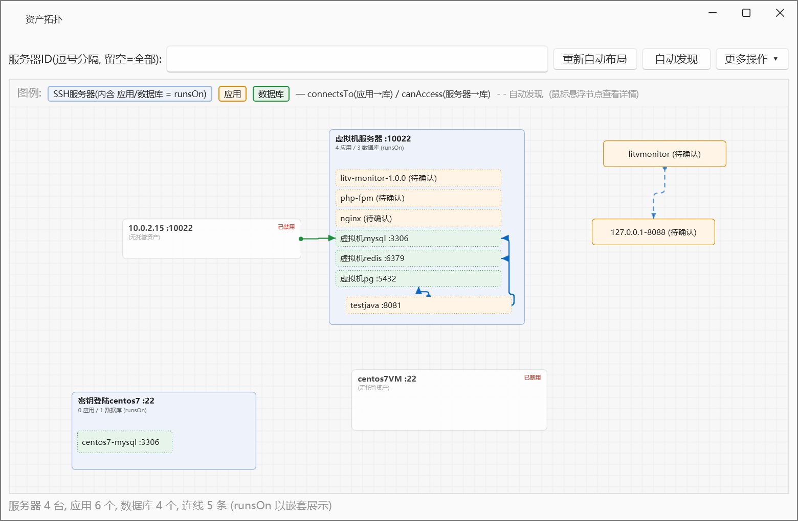
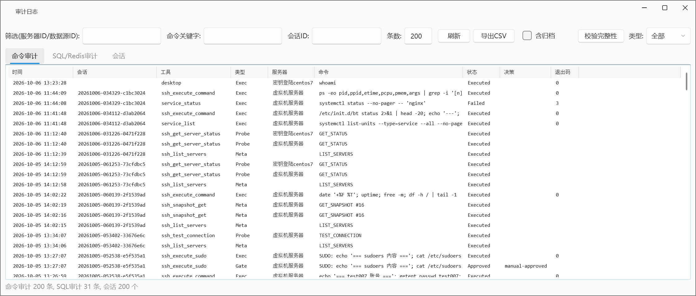
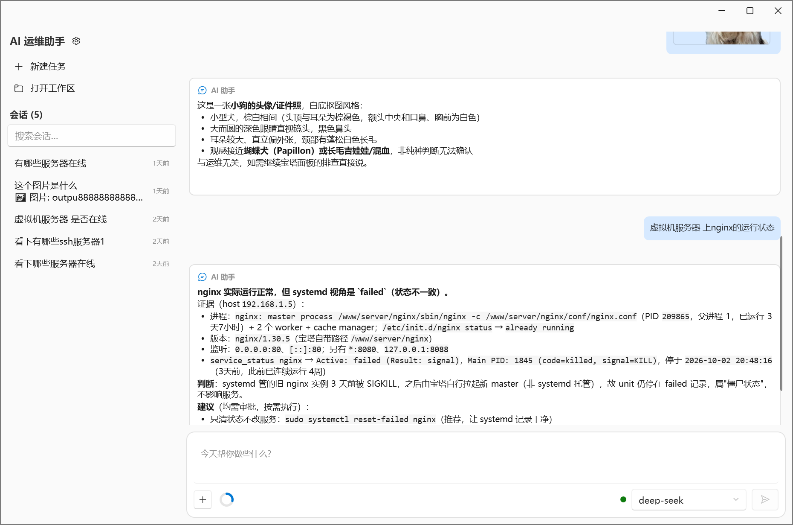
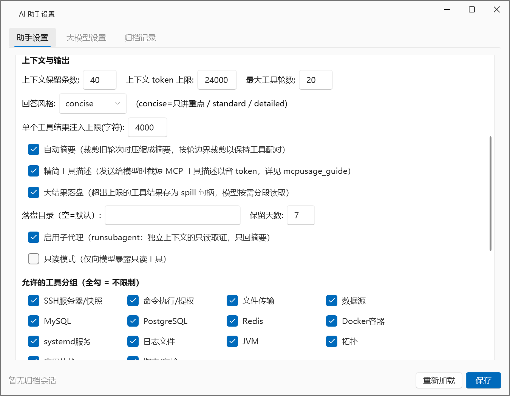

# LitSSH MCP

[](https://opensource.org/licenses/MIT)
[](https://dotnet.microsoft.com/)
[](https://windows.com/)
[](https://modelcontextprotocol.io/)
[](https://opencode.ai/)

> **让 AI 安全地运维你的服务器。** Windows 平台下的 **SSH / 数据库运维 MCP 服务器**，并配套一款 **WPF 桌面管理端（App）**——AI 智能体可通过 MCP 安全地管理远程 Linux 服务器，并贯通 **MySQL / PostgreSQL / Redis** 数据源与**资产拓扑**，支撑跨「服务器 / 应用(含 Docker 容器) / 数据库」的**全链路故障排查**。

<p align="center">
  
</p>

> 🤖 本项目使用 [Opencode](https://opencode.ai/) AI 助手开发。

## 📖 目录

- [项目简介](#项目简介)
- [MCP 服务](#mcp-服务)
- [桌面 App](#桌面-app)
- [架构与技术栈](#架构与技术栈)
- [快速开始](#快速开始)
- [配置](#配置)
- [使用示例](#使用示例)
- [安全模型](#安全模型)
- [提权配置](#提权配置)
- [命令行工具 CLI](#命令行工具-cli)
- [文档](#文档)
- [贡献](#贡献)
- [许可证](#许可证)

## 项目简介

LitSSH MCP 由两部分组成，可**独立使用**，也可组合使用：

| 组成 | 项目 | 说明 |
|------|------|------|
| **🤖 MCP 服务** | `LitSSHmcp.McpServer` | 基于 [Model Context Protocol](https://modelcontextprotocol.io/) 的 stdio 服务器，向任意 MCP 客户端（Claude Desktop / Cursor / Cline / CodeBuddy / opencode 等）暴露 **53 个工具**，安全地执行 SSH、数据库、Docker、日志、Java、拓扑等运维操作。 |
| **🖥️ 桌面 App** | `LitSSHmcp.App` | WPF 管理端：可视化维护服务器/数据源/应用/资产拓扑，内置审计日志、MCP 工具说明，以及**内嵌 MCP 客户端的 AI 运维助手**。 |

**核心亮点**

- 🔒 **安全默认**：命令 / SQL 过滤、敏感操作桌面审批、文件路径白名单、TOFU 主机密钥校验、按目标限流、**HMAC-SHA256 哈希链审计**。
- 🔑 **凭据隔离**：SSH / 数据库密码仅在本机 **DPAPI 加密**保存，工具入参与出参**均不包含密码**，AI 只能通过 `datasourceId` 引用数据源。
- 🧭 **全链路排障**：资产拓扑 + 整机快照 + 应用聚合体检，从「应用 → 服务器 → 数据库」贯通。
- 🤖 **内置 AI 运维助手**：App 内配置 OpenAI 兼容大模型，通过内嵌 MCP 客户端调用全部工具，安全策略与第三方客户端完全一致。

## MCP 服务

MCP 服务是纯粹的 stdio 进程，不依赖桌面界面；把它配置到任意 MCP 客户端，AI 即可安全地操作你的服务器与数据库。

### 能力概览

| 能力域 | 说明 |
|--------|------|
| **SSH 运维** | 命令执行、sudo 提权、连接测试 / 状态、文件上传下载（含批量 / 目录）、目录浏览、整机快照 |
| **数据源** | MySQL / PostgreSQL 只读查询、执行计划、写操作与诊断；Redis 只读与写 / 管理命令、诊断；支持直连或 SSH 隧道 |
| **容器与服务** | Docker 容器 / 镜像 / 日志 / inspect / stats；systemd 服务状态与日志 |
| **日志与 Java** | 日志按关键字 / 正则检索、日志文件发现；Java 进程 / 线程栈 / 堆内存 / JVM 信息 |
| **拓扑与体检** | 资产拓扑总览、上下游依赖查询、拓扑自动发现；按应用聚合体检 |
| **辅助** | 使用指南、MCP 自检、会话列表 |

<details>
<summary><b>查看全部 53 个工具</b>（点击展开）</summary>

> 完整参数 / 返回结构 / "用户意图 → 工具" 路由表见 **[docs/TOOLS.md](docs/TOOLS.md)**（唯一事实来源）。工具发生变动时，MCP 服务器端注解、`docs/TOOLS.md`、App 展示三处必须同步。

| Tool | 描述 |
|------|------|
| `ssh_list_servers` | 列出所有已配置的SSH服务器（已禁用的服务器不会出现） |
| `ssh_execute_command` | 在指定服务器执行Shell命令 |
| `ssh_execute_sudo` | 使用提权执行命令（权限不足时使用） |
| `ssh_get_sudo_status` | 获取服务器提权配置状态 |
| `ssh_get_server_status` | 获取服务器连接状态 |
| `ssh_test_connection` | 测试SSH连接 |
| `ssh_snapshot_get` | 查询服务器整机快照（资源/端口进程服务/Docker/nginx证书/systemd/**安全巡检**）；**默认返回各维度概览**，`section=` 取单维度完整数据、`detail="full"` 取全部，可查历史 |
| `ssh_snapshot_refresh` | 重新采集服务器整机快照（耗时较长、同机单飞；**有最短刷新间隔节流**，`force=true` 强制重采；失败也落库） |
| `ssh_get_command_history` | 查看命令执行历史 |
| `ssh_upload_file` | 上传本地文件到服务器 |
| `ssh_upload_files` | **批量/目录上传**（一条 SFTP 连接、整批一次审批、保留子目录结构） |
| `ssh_download_file` | 从服务器下载文件到本地 |
| `ssh_download_files` | **批量/目录下载**（一条 SFTP 连接、整批一次审批、保留子目录结构） |
| `ssh_list_files` | 浏览服务器目录 |
| `datasource_list` | 列出MySQL/PostgreSQL/Redis等数据源（主机/端口/账号/绑定关系，**无密码**） |
| `datasource_test_connection` | 测试数据库连通性（直连或SSH隧道） |
| `mysql_query` | 只读SQL查询（SELECT/SHOW/EXPLAIN） |
| `mysql_execute` | 写SQL（危险语句拒绝，敏感语句桌面审批） |
| `mysql_explain` | SQL执行计划分析 |
| `mysql_diagnostics` | MySQL诊断：连接数/慢查询/锁/复制/进程列表 |
| `postgres_query` | 只读SQL查询（PostgreSQL） |
| `postgres_execute` | 写SQL（PostgreSQL，危险语句拒绝，敏感语句审批） |
| `postgres_explain` | SQL执行计划分析（PostgreSQL） |
| `postgres_diagnostics` | PostgreSQL诊断：连接/活动会话/等待锁/复制/缓存命中/死锁 |
| `redis_read` | Redis只读命令（GET/HGETALL/INFO/SCAN/SLOWLOG等白名单） |
| `redis_execute` | Redis写/管理命令（一律桌面审批，危险命令直接拒绝） |
| `redis_diagnostics` | Redis诊断：内存/客户端/命中率/键空间/慢日志/主从/持久化 |
| `datasource_get_sql_history` | SQL与Redis命令审计历史（带 sessionId/tool，可过滤） |
| `docker_ps` | 列出Docker容器（结构化：名称/镜像/状态/端口） |
| `docker_logs` | 查看容器日志 |
| `docker_inspect` | 容器详情（inspect：环境/挂载/网络/健康检查） |
| `docker_stats` | 容器资源占用快照（CPU/内存/网络/磁盘IO） |
| `docker_images` | 镜像列表（版本/大小） |
| `docker_restart` | 重启容器（需审批） |
| `docker_exec` | 容器内执行命令（需审批） |
| `service_status` | systemd 服务状态 |
| `service_list` | 列出 systemd 服务 |
| `service_restart` | 重启 systemd 服务（需审批） |
| `service_logs` | 服务日志（journalctl） |
| `log_tail` | 查看日志文件尾部（可传 path 或 appId） |
| `log_grep` | 日志按关键字/正则检索（可传 path 或 appId） |
| `log_find` | 发现最近修改的日志文件（不知路径时先用它） |
| `java_processes` | 列出 Java 进程（可传 appId 过滤） |
| `java_threads` | 抓取线程栈（jstack，可传 appId 自动解析 pid） |
| `java_heap` | 堆内存/GC（jcmd + jstat） |
| `java_info` | JVM 版本/运行时长 |
| `app_health_snapshot` | 按应用聚合体检（所在服务器进程/容器/端口 + 依赖数据源连通性） |
| `topology_get_overview` | 资产拓扑图（服务器/应用/数据库及关系） |
| `topology_get_dependencies` | 查询某资产的上下游依赖 |
| `topology_discover` | 自动发现拓扑（java/服务进程/端口/ESTAB/JDBC/Redis/RabbitMQ/Kafka/Nginx/docker/processlist；有节流） |
| `mcp_usage_guide` | 获取使用指南 |
| `mcp_self_check` | MCP 自检（配置/审计/主机密钥，可测连通性；返回当前会话ID/客户端） |
| `mcp_list_sessions` | 列出最近 MCP 会话（会话ID/客户端/首末活动） |

</details>

**工具分组（按部署裁剪）**：默认暴露全部 53 个工具；可在 App 的 **设置 → 工具分组** 勾选，或直接改 `config.json` 的 `tools.enabledGroups`，只启用需要的分组（`ssh` / `command` / `fileTransfer` / `datasource` / `mysql` / `postgres` / `redis` / `docker` / `service` / `log` / `java` / `topology` / `app` / `guide`），降低 AI 上下文占用与误选。留空 / 不写 = 全部，`["all"]` = 全部，`["none"]` = 全部停用。

**AI 排障 Skill**：仓库内置 [`docs/litssh-mcp-ops-skill/SKILL.md`](docs/litssh-mcp-ops-skill/SKILL.md)（工具无关，随仓库分发），供支持 skills 的 AI 智能体（opencode / Claude 等）使用。内容包含工具路由、标准排障流程、日志路径发现，以及 **MCP 未覆盖能力经 SSH 变通**的方案（如按 Java 启动命令 / 配置文件定位日志后再用 `log_tail`）。可复制到对应智能体的 skill 目录，或在 opencode 中用 `skills.paths` 指向该目录。

### 在 AI 客户端中配置 MCP

先发布（见 [快速开始](#快速开始)）得到 `LitSSHmcp.McpServer.exe`，再按客户端填入配置。

<details>
<summary><b>Claude Desktop</b>（编辑 <code>%APPDATA%\Claude\claude_desktop_config.json</code>）</summary>

```json
{
  "mcpServers": {
    "litssh": {
      "command": "C:\\path\\to\\publish\\LitSSHmcp.McpServer.exe"
    }
  }
}
```
</details>

<details>
<summary><b>Cursor / Windsurf</b>（编辑 <code>.cursor/mcp.json</code>）</summary>

```json
{
  "mcpServers": {
    "litssh": {
      "command": "C:\\path\\to\\publish\\LitSSHmcp.McpServer.exe"
    }
  }
}
```
</details>

<details>
<summary><b>Cline (VS Code)</b>（编辑 <code>.vscode/mcp.json</code>）</summary>

```json
{
  "servers": {
    "litssh": {
      "command": "C:\\path\\to\\publish\\LitSSHmcp.McpServer.exe"
    }
  }
}
```
</details>

<details>
<summary><b>CodeBuddy</b>（编辑 <code>~/.codebuddy/.mcp.json</code>）</summary>

```json
{
  "mcpServers": {
    "litssh": {
      "type": "stdio",
      "command": "C:\\path\\to\\publish\\LitSSHmcp.McpServer.exe"
    }
  }
}
```
</details>

<details>
<summary><b>开发模式（使用 dotnet run）</b></summary>

```json
{
  "mcpServers": {
    "litssh": {
      "command": "dotnet",
      "args": ["run", "--project", "C:\\path\\to\\LitSSHmcp\\src\\LitSSHmcp.McpServer", "--no-build"]
    }
  }
}
```
</details>

### 验证

重启 AI 客户端后，输入以下内容测试：

```
请列出所有SSH服务器
```

AI 会调用 `ssh_list_servers` 工具返回服务器列表。

## 桌面 App

WPF 桌面管理端，主界面为**左侧图标导航栏 + 右侧页面**：顶部依次为 **主页 / SSH 服务器管理 / 数据源管理 / 应用管理**（页面形式）；分割线以下为 **资产拓扑 / 审计日志**（独立非模态窗口，不置顶，可同时操作主界面）；**最下方为「设置」**（外观 / 终端 / 命令片段 / 安全设置 / 工具分组 / 导入导出 / MCP 工具说明 / 关于）。**AI 运维助手**（内置大模型运维智能体）从主页快捷入口或 AI 快捷提问打开。

### 主页看板

**快捷入口**（SSH 会话管理 / 数据源管理 / 应用管理 / 资产拓扑 / 审计日志 / AI 运维助手）、**数据看板**（SSH 服务器总数与禁用数、数据源数、应用数）、**AI 快捷提问**（输入问题或添加附件后发送，会填入 AI 运维助手输入区）。


### SSH 服务器管理与会话

**SSH 服务器管理**页提供服务器表格：顶部仅 **添加 / 刷新**，其余操作走条目**右键菜单**（连接 / 编辑 / 采集快照 / 快照历史 / 删除），**双击**行打开编辑窗口，支持列排序。右键**「连接（命令会话）」**或**「打开终端（交互式）」**打开独立的 **「SSH 会话管理」多标签窗口**（非模态、不置顶）。命令会话标签可执行命令、查看输出与最近活动、测试连接；**终端标签**为交互式 PTY shell（自绘 VT100/ANSI，支持 `vim`/`top`/`htop`/`less`、颜色、滚动回看、窗口自适应），且**左侧分栏内嵌服务器文件可视化**（SFTP：目录导航、上传 / 下载、新建文件夹、重命名、删除，双击文件下载并打开）。





**采集快照**会连服务器采集整机态势（资源 / 端口进程服务 / 证书 / systemd 健康 / 安全巡检，同步、典型 10~30 秒，同一服务器同时只允许一个），完成后打开**快照历史窗口**：可切换服务器，左列历史列表 → 右侧查看该次快照的**采集维度概览 / 采集事件 / 原始数据**。



### 数据源与应用管理

- **数据源管理**：维护 MySQL / PostgreSQL / Redis 等数据源；顶部 **添加 / 刷新**，条目**右键菜单**为 测试连接 / 编辑 / 删除，双击也可编辑（类型切换时自动带出默认端口 3306/5432/6379）；可设置**治理**项（只读、最大行数、超时、写审批策略）。密码仅本机 DPAPI 加密保存、不对 AI 开放。删除时会提示并级联清理引用它的关系。
- **应用管理**：维护 `app:` 应用节点（名称 / 类型 / 端口 / 主机 / 描述）；Docker 应用把类型填 `docker` 并填**容器名**（与 `docker ps` 的 NAMES 一致），AI 即可用 SSH 工具管理；顶部 **添加 / 刷新**，条目**右键菜单**为 编辑 / 删除，双击也可编辑。



### 资产拓扑（可视化编辑）

一张可交互画布，服务器 / 应用 / 数据库及关系可视化（`runsOn` 内嵌、`connectsTo` / `canAccess` 避障正交连线 + 圆点 / 箭头 / 过桥），支持**直接编辑**：

- **拖动**节点（拖服务器带动其内子节点）、**缩放**节点（四角手柄 + 四边内侧直接拉伸）；
- 从节点**边中点端口**拖到另一节点创建关系（自动推断类型并做逻辑校验）；
- **点选连线**后右侧出现**关系属性面板**：修改**关系类型**、编辑**备注**并保存，或删除（也可按 `Delete`）；
- **无限画布**：滚轮缩放、**左键按住空白处拖动平移**、**「更多操作 ▾」**（`＋ / － / 适应 / 100%`（`Ctrl+0` 重置）/ 刷新 / **导出图片…**）；**网格吸附（10px）**；关系属性面板可拖动；
- **拖动节点进出服务器**：完全落入时自动建立 `runsOn`（不合法则禁止并提示），从服务器内拖出会确认删除 `runsOn`；节点与服务器不允许部分重叠；**服务器缩小时托管子节点自动收紧**；
- **节点右键 → 查看/编辑关系**：列出相关全部关系（手动 / 自动发现），可删除或编辑类型与备注；**解除 `runsOn`** 后相关应用 / 数据库自动挪到就近空白处；
- **Ctrl+Z 撤销 / Ctrl+Y 重做**、**「重新自动布局」**；
- 手动布局保存在 `%APPDATA%\LitSSH\topology-layout.json`，与应用 / 数据源配置分离；
- 关系逻辑校验（`runsOn` 只能 应用/数据库→服务器 且**每节点只 runsOn 一台**、`connectsTo` 只能 应用→数据库、`canAccess` 只能 服务器→数据库、禁止自环）在创建时即时生效。

关系示例：

```
app:order-service  --runsOn-->     ssh:web-server-01    # 应用运行在服务器
ds:mysql-order-01  --runsOn-->     ssh:db-server-01     # MySQL 运行在服务器(数据库也可 runsOn)
app:order-service  --connectsTo--> ds:mysql-order-01    # 应用连接数据库
ssh:web-server-01  --canAccess-->  ds:mysql-order-01    # 服务器可访问数据库
```



### 审计日志

查看命令 / SQL 审计；支持按 服务器 / 数据源 ID 筛选 + **命令关键字模糊查询** + **按会话 ID 筛选**、复制、导出 CSV、**含归档**（超期记录永久保留）与 **校验完整性**（哈希链防篡改）。



### AI 运维助手

App 内置的**大模型运维智能体**——在 App 内配置 **OpenAI 兼容大模型**（DeepSeek / 通义千问 / Kimi / 智谱 GLM / 硅基流动 / 本地 Ollama 等，可**多模型启用 / 停用**、设默认、**对话中热切换**），用自然语言对话完成服务器 / 数据源 / 应用运维。它通过**内嵌 MCP 客户端**（stdio 子进程）调用本机 MCP 服务器，即**全部 53 个工具**，因此**桌面审批、命令过滤器、审计哈希链与第三方 AI 客户端完全一致**。

- **对话体验**：流式输出、**多会话管理**（新建 / 切换 / 删除、首条消息自动命名，独立 `agent.db`）、**只读模式**（仅暴露只读工具）、**工具分组裁剪**；回答以 **Markdown 渲染**，每轮按 **用户指令(带时间) → 工具过程 → 回答(带时间与耗时)** 展示（工具过程运行中展开、完成后折叠）。
- **技能与工具**：把 `litssh-mcp-ops-skill` 作为**技能**注入系统提示；自动注入**工作区文档工具** `ops_doc_read/write/append/patch/list`（维护 `OPS_ASSETS.md` 运维资产档案，按需读、增量写）与**任务计划工具** `update_plan`（顶部**任务计划面板**显示进度 ☑/☐）。
- **可选长期记忆 / RAG**：配置 OpenAI 兼容 **Embeddings** 端点即可把历史会话与工作区文档向量化、按相似度**召回**注入上下文。
- **稳定性与成本**：每模型可配**超时 / 重试 / 并发**并对失败给出**分类提示**；系统提示内置**提示注入防护**；**技能按需加载**、**工具描述精简**、**快照默认返回概览**、**大结果落盘句柄**（`spill_read`/`spill_grep`）与**子代理隔离**（`run_subagent` 只回摘要）；系统提示 / 工具定义为**稳定前缀**以配合 **Prompt Caching**；**回答风格**可选 `concise`(默认) / `standard` / `detailed`。
- **安全**：模型 API Key 本机 **DPAPI 加密**存储；破坏性工具调用会提示"可能等待人工审批"。

> 首次使用请在助手的「AI 助手设置」中添加并启用模型（发布包已内置 MCP 服务器 exe：`mcp/LitSSHmcp.McpServer.exe`）。



### 设置

多 Tab 设置窗口：**外观**（深色 / 浅色 / 跟随系统 + 强调色）、**终端**、**命令片段**、**安全设置**（命令 / SQL 过滤、文件传输、主机密钥、限流、审计策略、授权弹窗与审批通道、结果脱敏、服务器快照、SSH 连接复用池）、**工具分组**、**导入 / 导出** 配置、**MCP 工具说明**（可一键复制到提示词）、**关于**。



## 架构与技术栈

```
┌─────────────────────┐   ┌─────────────────────┐   ┌─────────────────────┐
│ LitSSHmcp.McpServer │   │    LitSSHmcp.App    │   │    LitSSHmcp.Cli    │
│  MCP服务器(stdio)    │   │  WPF 管理界面(MVVM)  │   │   终端 SSH 工具      │
└──────────┬──────────┘   └──────────┬──────────┘   └──────────┬──────────┘
           └─────────────────────────┼─────────────────────────┘
                                     ▼
                     ┌───────────────────────────────┐
                     │        LitSSHmcp.Core         │
                     │  Models + Services            │
                     │  SSH | Datasource | Topology  │
                     │  Security | Storage           │
                     └───────────────┬───────────────┘
                                     ▼
              %APPDATA%\LitSSH (config.json) + SQLite (审计/快照/会话) + 远程资产
```

| 项目 | 框架 | 职责 |
|------|------|------|
| `LitSSHmcp.Core` | net8.0 | 数据模型 + 全部业务服务（SSH / 数据源 / 拓扑 / 安全 / 存储） |
| `LitSSHmcp.McpServer` | net8.0-windows | MCP 服务器（stdio）、53 个工具、授权确认弹窗 |
| `LitSSHmcp.App` | net8.0-windows | WPF 管理端（服务器 / 数据源 / 应用 / 资产拓扑 / 安全 / 审计 / AI 运维助手） |
| `LitSSHmcp.Agent` | net8.0 | 内置 AI 运维助手（大模型 + 内嵌 MCP 客户端） |
| `LitSSHmcp.Cli` | net10.0 | 终端 SSH 工具（`litssh list/connect/run/approve`） |

**技术栈**：.NET 8 · WPF + [WPF-UI](https://github.com/lepoco/wpfui)（Fluent）· ModelContextProtocol SDK · SSH.NET · MySqlConnector / Npgsql · SQLite · Windows DPAPI。详细设计见 [docs/ARCHITECTURE.md](docs/ARCHITECTURE.md)。

## 快速开始

### 环境要求

- Windows 10/11
- [.NET 8 SDK](https://dotnet.microsoft.com/download)（构建 CLI 需要 .NET 10 SDK）

### 1. 编译项目

```bash
git clone https://github.com/joolan/LitSSHmcp.git
cd LitSSHmcp
dotnet build LitSSHmcp.slnx
dotnet test  LitSSHmcp.slnx   # 全部测试(Core + Agent + MCP 服务器 + App，共 496 用例)
```

### 2. 发布

```bash
# MCP 服务器（独立产物）
dotnet publish src/LitSSHmcp.McpServer -c Release -r win-x64 --self-contained -o publish

# 桌面 App（含内置 MCP 服务器到 App 的 mcp/ 子目录）
dotnet publish src/LitSSHmcp.App -c Release -r win-x64 --self-contained -o publish-app

# CLI 工具
dotnet publish src/LitSSHmcp.Cli -c Release -r win-x64 --self-contained -o publish-cli
```

> 也可使用一键脚本：`powershell -ExecutionPolicy Bypass -File scripts\build-release.ps1 -Version v1.0.0`

### 3. 配置 SSH 服务器

**方式一：使用 WPF 管理界面（推荐）**

```bash
dotnet run --project src/LitSSHmcp.App
```

在 **SSH 服务器管理** 页添加服务器（主机 / 端口 / 账号 / 密码或密钥 / 提权方式），随后即可在 App 内连接、采集快照、查看拓扑，或把 MCP 服务接入 AI 客户端。

**方式二：手动编辑配置文件**

配置文件位置：`%APPDATA%\LitSSH\config.json`（也可参考 [`config/config.example.json`](config/config.example.json)），完整字段见 [配置](#配置)。

### 4. 在 AI 客户端中配置 MCP

见上文 [在 AI 客户端中配置 MCP](#mcp-服务)。

### 5. 验证

重启 AI 客户端后输入 `请列出所有SSH服务器`，AI 会调用 `ssh_list_servers` 返回服务器列表。

## 配置

配置文件位置：`%APPDATA%\LitSSH\config.json`

```json
{
  "servers": [
    {
      "id": "my-server",
      "name": "我的服务器",
      "host": "192.168.1.100",
      "port": 22,
      "username": "root",
      "authType": "Password",
      "password": "your-password",
      "sudoType": "CurrentUser",
      "sudoPassword": "your-sudo-password"
    }
  ],
  "dataSources": [
    {
      "id": "mysql-order-01",
      "name": "订单库",
      "type": "mysql",
      "host": "192.168.1.101",
      "port": 3306,
      "username": "order_app",
      "password": "your-db-password",
      "defaultDatabase": "orders",
      "accessMode": "sshTunnel",
      "tunnelServerId": "my-server"
    },
    {
      "id": "redis-cache-01",
      "name": "缓存",
      "type": "redis",
      "host": "192.168.1.101",
      "port": 6379,
      "username": "",
      "password": "your-redis-password",
      "defaultDatabase": "0",
      "accessMode": "sshTunnel",
      "tunnelServerId": "my-server"
    },
    {
      "id": "pg-report-01",
      "name": "报表库",
      "type": "postgres",
      "host": "192.168.1.101",
      "port": 5432,
      "username": "report_app",
      "password": "your-pg-password",
      "defaultDatabase": "report",
      "accessMode": "sshTunnel",
      "tunnelServerId": "my-server",
      "readOnly": true,
      "maxRows": 500,
      "timeoutSeconds": 30,
      "writeApproval": "Always"
    }
  ],
  "applications": [
    { "id": "order-service", "name": "订单服务", "type": "java", "port": 8080, "host": "192.168.1.100" },
    { "id": "order-worker", "name": "订单Worker", "type": "docker", "containerName": "order-worker", "host": "192.168.1.100" }
  ],
  "relations": [
    { "from": "app:order-service", "to": "ssh:my-server", "type": "runsOn" },
    { "from": "app:order-worker", "to": "ssh:my-server", "type": "runsOn" },
    { "from": "app:order-service", "to": "ds:mysql-order-01", "type": "connectsTo" },
    { "from": "ssh:my-server", "to": "ds:mysql-order-01", "type": "canAccess" }
  ],
  "tools": {
    "enabledGroups": ["ssh", "command", "datasource", "mysql", "postgres", "redis", "docker", "service", "log", "java", "topology", "app", "guide"]
  },
  "security": {
    "enabled": true,
    "commandFilter": {
      "blockedCommands": ["rm -rf /", "mkfs", "dd if=/dev/zero"],
      "sensitiveCommands": ["rm ", "chmod", "reboot", "shutdown"],
      "sensitivePatterns": ["\\brm\\b", "\\bchmod\\b"]
    },
    "sqlFilter": {
      "blockedPatterns": ["\\btruncate\\b", "\\bgrant\\b"],
      "sensitivePatterns": ["\\binsert\\b", "\\bupdate\\b", "\\bdelete\\b"]
    },
    "fileTransfer": {
      "enabled": true,
      "requireApproval": true,
      "maxFileSizeBytes": 104857600,
      "allowedLocalPaths": ["C:\\Users\\you\\Desktop"],
      "allowedRemotePaths": ["/home", "/tmp", "/var/log"]
    },
    "sshHostKey": { "mode": "tofu" },
    "discovery": { "allowedSearchPaths": ["/opt", "/home", "/srv", "/app", "/data", "/etc/nginx"], "useSudo": false },
    "limits": { "maxConcurrentPerTarget": 3, "maxCallsPerMinutePerTarget": 60 },
    "audit": { "storeSqlText": true, "maskLiterals": false, "retentionDays": 90 },
    "masking": { "rules": [ { "column": "phone|mobile", "mode": "phone" } ] },
    "approval": { "style": "process", "mode": "manual", "channels": ["desktop", "cli"], "timeoutSeconds": 45, "topMost": true }
  },
  "connectionPool": { "enabled": true, "idleTimeoutSeconds": 300, "keepAliveSeconds": 30, "connectTimeoutSeconds": 20, "maxPerServer": 1 },
  "ui": { "theme": "system", "accent": "" }
}
```

> 所有明文密码在保存 / 加载时会自动迁移为 **DPAPI 密文**（`enc:` 前缀），仅当前 Windows 用户可解密。访问模式、拓扑关系类型、审批弹窗样式等含义详见 [docs/ARCHITECTURE.md](docs/ARCHITECTURE.md)。

## 使用示例

### 执行命令

```
在Web服务器上执行 df -h 查看磁盘空间
```

### 提权执行

```
查看nginx进程状态（需要root权限）
```

AI 会自动使用 `ssh_execute_sudo` 工具提权执行。

### 文件传输

```
把本地的 config.yml 上传到服务器的 /etc/nginx/ 目录
下载服务器上的 /var/log/nginx/access.log 到桌面
```

### 数据源与拓扑排查

```
订单服务报错了，帮我排查一下
```

AI 的典型排查链路：

1. `topology_get_overview` 拿到全局拓扑：订单服务（Java）运行在哪台 SSH 服务器、连接了哪个 MySQL
2. `topology_get_dependencies(app:order-service)` 精确获取上下游依赖
3. SSH 侧：`ssh_execute_command` 查看 java 进程、端口、应用日志中的数据库连接异常
4. 数据库侧：`mysql_diagnostics` 看连接数 / 慢查询 / 锁等待 / 复制状态，`mysql_query` 查 `SHOW FULL PROCESSLIST` 与慢日志，`mysql_explain` 分析问题 SQL；涉及缓存时用 `redis_diagnostics` 看内存 / 命中率 / 慢日志、`redis_read` 查具体 key
5. 跨机关联：应用日志里的数据库 IP 与 `datasource_list` 返回的 `host/port` 对应，即可确认是哪个数据源（MySQL 3306 / Redis 6379 皆可匹配）
6. 拓扑过期时用 `topology_discover` 自动补全（扫描 java / 通用服务进程、监听端口、ESTAB 连接、配置文件 JDBC / Redis / RabbitMQ / Kafka / Nginx、docker 容器、MySQL processlist）；发现做了**节流**（同时只跑一个）；未登记的应用 / 数据源 / 客户端会以 `*:disc:*` "待确认"节点出现，可在拓扑页**右键 → 确认节点**登记为资产。

### 授权确认弹窗

敏感操作（敏感命令、敏感 SQL、文件传输）会弹出确认框，默认**置顶**且 **45 秒无操作自动拒绝**。样式由 `security.approval.style` 控制：

- `process`（推荐）：启动独立子进程显示弹窗，规避部分宿主（如 Electron 客户端）的隐藏窗口问题；
- `dialog`：MCP 进程内显示；
- `native`：原生置顶 MessageBox（无超时）。

审批**通道**由 `security.approval.channels` 控制（默认 `["desktop","cli"]`）：`desktop`（本机弹窗）/ `cli`（带外，操作员用 `litssh approvals` 查看、`litssh approve/deny <id>` 决定）；可同时启用，**首个给出决定者生效**。结果为 `rejected`（拒绝）/ `approval_timeout`（超时）/ `approval_unavailable`（无可用通道）。

## 安全模型

- **全局开关**：安全设置中的「启用 MCP 服务」关闭后**拒绝所有工具调用**（`security.enabled`，按配置热生效、无需重启）
- **禁止命令列表**：直接拒绝执行危险命令
- **敏感命令列表**：弹出桌面窗口提示用户确认后执行
- **授权确认弹窗**：置顶确认框，默认 **45 秒无操作自动拒绝**；可选独立子进程 / 原生弹窗样式（`security.approval`）
- **审批通道与模式**：`security.approval.channels` / `security.approval.mode`（`manual` / `auto-approve` / `auto-reject`）
- **文件传输审批**：上传 / 下载需用户确认，并受**本地 / 远程路径白名单**与大小上限约束（`allowedLocalPaths` / `allowedRemotePaths` / `maxFileSizeBytes`）；文件夹 / 多文件用 `ssh_upload_files` / `ssh_download_files`（一条 SFTP 连接、整批一次确认、保留子目录层级）
- **主机密钥校验 (TOFU)**：首次连接记录 SSH 主机指纹，之后指纹变化即拒绝（`security.sshHostKey.mode = tofu|strict|off`）
- **按目标限流**：单服务器 / 数据源的并发数与每分钟调用上限（`security.limits`）
- **SSH 连接复用池**：每服务器复用一条 SSH 连接、执行完不断开、空闲自动断开（`connectionPool.*`；默认开、空闲 300s、每服务器 1 条），避免 AI / 密集调用反复"连-断"触发目标机登录告警
- **凭据隔离**：数据库 / SSH 账号密码仅保存在本机（DPAPI 加密落盘），任何 MCP 工具的入参与出参都不包含密码，AI 智能体只能通过 `datasourceId` 引用数据源
- **SQL 安全过滤**：`mysql_query` / `postgres_query` 仅允许只读语句；写语句中无 WHERE 的 DELETE / UPDATE、DROP TABLE / DATABASE、GRANT 等直接拒绝，其余敏感写语句需桌面确认
- **Redis 安全策略**：`redis_read` 只放行只读白名单命令；`redis_execute` **所有写操作一律桌面审批**，FLUSHALL / SHUTDOWN / DEBUG / SUBSCRIBE 等危险与阻塞类命令直接拒绝
- **Docker 安全规则**：默认拒绝 `docker system prune` / `docker volume rm` / `docker network prune` / `docker run --privileged` 等；`docker rm/rmi/kill/stop/restart/run/exec/compose down` 等写操作需桌面确认（只读的 `docker ps/logs/inspect/stats` 不受限）
- **审计日志**：记录所有命令与 SQL（含被拒绝的），支持 SQL 原文开关、字面量脱敏、**超期记录归档到历史表永久保留**；审计写入 **HMAC-SHA256 哈希链**，可在「审计日志」中**校验完整性**检测篡改（`security.audit`）；每条记录带 **MCP 会话 ID**，便于按会话区分
- **提权执行**：权限不足时可使用 sudo 提权（见 [提权配置](#提权配置)）

## 提权配置

| 提权方式 | 说明 | 适用场景 |
|---------|------|---------|
| 不启用 | 不使用提权 | 普通用户操作 |
| 当前用户sudo | 使用 SSH 用户密码执行 sudo | CentOS / Ubuntu / Debian 常用 |
| root用户 | 切换到 root 用户 | 需要 root 密码 |
| 指定用户 | 切换到指定用户 | 需要该用户密码 |
| 自动 | 先试「当前用户 sudo」，失败再试「su - root」（同一提权密码） | 不确定账号是否在 sudoers / 是否配了 root 密码时；推荐 |

**Linux sudo 机制**：

- `sudo command` 需要输入**当前 SSH 用户**的密码
- 如果 sudoers 配置了 `NOPASSWD`，则不需要密码
- root 用户执行 sudo 不需要密码

## 命令行工具 (CLI)

LitSSH 提供命令行 SSH 连接工具，可直接在终端连接服务器。

```bash
# 发布
dotnet publish src/LitSSHmcp.Cli -c Release -r win-x64 --self-contained -o publish-cli

# 使用
litssh list                        # 列出所有服务器
litssh connect web-server          # 连接到服务器(交互式)
litssh run web-server "df -h"      # 在服务器上执行单条命令
litssh run my-server "docker ps"

# 带外审批(无桌面/headless 时)
litssh approvals                   # 列出待审批的敏感操作
litssh approve <审批ID>            # 批准
litssh deny <审批ID>               # 拒绝
```

## 文档

| 文档 | 内容 |
|------|------|
| [docs/ARCHITECTURE.md](docs/ARCHITECTURE.md) | 架构设计：分层结构、核心模块、安全模型、拓扑模型、线程模型、扩展点 |
| [docs/TOOLS.md](docs/TOOLS.md) | 53 个 MCP 工具完整参考：参数、返回结构、"用户意图→工具"路由表 |
| [docs/CHANGELOG.md](docs/CHANGELOG.md) | 迭代历史：每个版本的新增 / 修复 / 变更记录 |
| [docs/UPGRADE_PLAN.md](docs/UPGRADE_PLAN.md) | 升级方案（Roadmap）：安全、可视化配置、运维、质量的分期计划 |
| [docs/litssh-mcp-ops-skill/SKILL.md](docs/litssh-mcp-ops-skill/SKILL.md) | AI 排障 Skill（工具路由、标准排障流程、SSH 变通方案） |

## 贡献

欢迎贡献！请提交 Issue 或 Pull Request。架构与开发约定见 [docs/ARCHITECTURE.md](docs/ARCHITECTURE.md)。

## 许可证

本项目采用 **MIT 许可证** —— 查看 [LICENSE](LICENSE) 文件了解详情。

## 🔗 相关链接

- [Model Context Protocol](https://modelcontextprotocol.io/)
- [WPF-UI (Fluent)](https://github.com/lepoco/wpfui)
- [SSH.NET](https://github.com/sshnet/SSH.NET)
- [.NET 8](https://dotnet.microsoft.com/)

## 🙏 致谢

- 感谢 [Opencode](https://opencode.ai/) 作为开发助手参与本项目。
- 感谢所有开源依赖的维护者。

> 如有问题或建议，欢迎提交 [Issue](https://github.com/joolan/LitSSHmcp/issues)。
